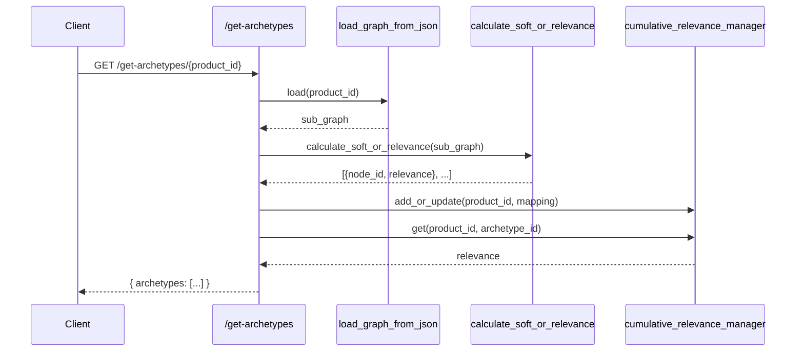
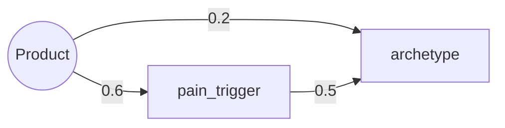

# Reverse Case Study (RCS) Simulation — Specification

## Scope
Documents the RCS generation pipeline centred on `simulate_rcs(product_subgraph, archetype_id, zmot_id=None)` and all internal functions it calls. Library APIs (e.g., NetworkX primitives) are omitted.

## Entry Point
- `utils/inference/rcs_generators/rcs_simulator.py::simulate_rcs(product_subgraph, archetype_id, zmot_id=None)`
  - Purpose: compute the most likely first-response chain (archetype → trigger → pain → job → persona), overlay belief signals, and reconstruct causal paths from product to that job.

## High-level Flow
1. Build a focused subgraph with temporal depth.
2. Derive persona influence adjacency and baseline belief metrics.
3. Score first-response “pain families” and pick the most likely path.
4. Compute belief what‑if and next-best actions.
5. Reconstruct causal chains (product → … → job) and assemble output.

## Called Functions (Internal)
- `rcs_generator_engine.build_archetype_subgraph_with_temporal_depth(G, archetype_id, zmot_id=None, ...)`:
  - Seeds the archetype (depth 0) and its triggers (`prevalent_in`).
  - Queues terminal pains from triggers (`triggered_by` and no `felt_in` jobs), then breadth‑first:
    - Adds pain at depth d; gates by cumulative relevance.
    - From each pain: add solving jobs/capabilities (`solves`), attach personas (`performed_by`), enqueue additional pains (`felt_in`).
    - Adds the product node for capabilities linked via `offers`.
  - If provided, inserts `zmot_id` at depth 0.
  - Emits a subgraph with node attribute `depth` and a belief bundle created from persona adjacency (see below).

- `rcs_generator_engine.build_persona_adjacency_from_subgraph(G_a) -> (A, persona_ids)`:
  - Builds a directed influence matrix between personas when a pain is felt in one persona’s job and solved by another’s job:
    - `u <-performed_by- job_u <-felt_in- pain -solves-> job_v -performed_by-> v`
  - Edge weight u→v = product of edge likelihoods along the pattern.

- Graph helpers (from `utils/graph_base/network_graph.py`):
  - `get_node_by_id`, `get_product_id_from_subgraph`.
  - `get_edge_weight`, `get_edge_attribute` (typed: `likelihood`, `relevance`, `boost`).
  - `get_source_nodes_by_target_and_type`, `get_target_nodes_by_source_and_type` (edge `type` filters).

- Belief machine (from `beliefs/machine.py` and `beliefs/states.py`):
  - `ProbBeliefMachine(A, r, beta)`: builds row‑normalized influence, fundamental matrix `T`, initial state `pi` (all Unaware).
  - `activation(mode)`, `expected_score(mode)`, `marginal_lift_if_forced(...)`.
  - Local helpers: `_current_stage`, `_next_stage`, `marginal_lift_for_persona`, `recommend_next_actions`.

- Local content helper in simulator:
  - `_node_content(G, node_id)`: returns concise content for node types (job, persona, pain, capability, product, metric, pain_trigger, archetype, zmot).

## simulate_rcs Details
- Subgraph build: calls `build_archetype_subgraph_with_temporal_depth`. Reads `belief_init` (if any) and restores `pi` into a new `ProbBeliefMachine`; records baseline `activation_SOL/PR` and `expected_score_SOL/PR`.
- First-response scoring: for each trigger from the archetype (depth 1), compute boosted trigger likelihood using `boost` from `zmot` (if provided). For each connected pain (depth 1):
  - Compute pain likelihood; collect perceived metrics (`expressed_as`).
  - Collect solving jobs (`solves`) and, per job, personas (`performed_by`); propagate likelihood multiplicatively.
- Path selection: choose the chain with maximal likelihood and persist IDs and scores.
- Belief what‑if: compute top‑K next actions and marginal lift for the most‑likely persona.
- Causal reconstruction: find simple paths from product → selected job and annotate each node with content, depth, and propagated likelihood.

## Output Structure (abridged)
```
{
  "archetype": {...},
  "first_response_pain_family": [ { pain_trigger, trigger_likelihood, trigger_depth }, ... ],
  "most_likely_first_response_path": {
    pain_trigger, trigger_likelihood, trigger_depth,
    pain, pain_likelihood, perceived_metrics, job, job_likelihood, persona
  },
  "causal_chains": [ [ { node_content, node_likelihood, node_depth }, ... ], ... ],
  "belief": {
    personas, activation_SOL, activation_PR,
    expected_score_SOL, expected_score_PR,
    marginal_lift_example, next_best_actions
  }
}
```

## Mermaid Diagrams

### Sequence
```mermaid
sequenceDiagram
    participant Client
    participant Simulator as simulate_rcs
    participant Engine as rcs_generator_engine
    participant Belief as ProbBeliefMachine
    participant Graph as network_graph

    Client->>Simulator: simulate_rcs(product_subgraph, archetype_id, zmot_id?)
    Simulator->>Engine: build_archetype_subgraph_with_temporal_depth(...)
    Engine-->>Simulator: archetype_subgraph (depth, belief_bundle)
    Simulator->>Engine: build_persona_adjacency_from_subgraph(archetype_subgraph)
    Engine-->>Simulator: A_persona, persona_order
    Simulator->>Belief: init(A_persona, r, beta); restore π if present
    Belief-->>Simulator: activation/expected scores
    Simulator->>Graph: traverse triggers/pains/jobs/personas
    Graph-->>Simulator: nodes, attrs, edge weights/attrs
    Simulator->>Simulator: select most-likely trigger→pain→job→persona
    Simulator->>Belief: recommend_next_actions(); marginal_lift_if_forced()
    Belief-->>Simulator: next_best_actions, marginal_lift
    Simulator->>Graph: all_simple_paths(product → job)
    Graph-->>Simulator: paths
    Simulator-->>Client: final_rcs
```

### Flowchart
```mermaid
flowchart TD
    A[Input: product_subgraph, archetype_id, zmot_id?] --> B[Build archetype subgraph with temporal depth]
    B --> C[Build persona adjacency]
    C --> D{Personas exist?}
    D -- Yes --> E[Init ProbBeliefMachine and baseline metrics]
    D -- No --> F[Empty belief bundle]
    E --> G[Enumerate triggers prevalent_in archetype]
    F --> G
    G --> H[Compute boosted trigger likelihood (optional ZMOT boost)]
    H --> I[Collect pains (depth 1)]
    I --> J[For each pain: metrics, jobs, personas; multiply likelihoods]
    J --> K[Pick most-likely trigger→pain→job→persona]
    K --> L[Belief what‑if: top‑K actions, marginal lift]
    L --> M[Reconstruct causal chains product → job]
    M --> N[Assemble final_rcs]
```

## Archetype Computation

Archetypes are ICP nodes scored by graph relevance.

- Entry: `routes/analyzer.py#get_archetypes` → `utils/knowledge_base/zmot_icp_generation.get_archetypes_by_relevance`.
- Input graph: loaded via `load_graph_from_json(product_id)`; nodes include `product`, `archetype`, etc.; edges carry numeric `weight` in [0,1].
- Soft‑OR relevance (seeded at product):
  - Initialize: `rel[product] = 1.0`, others `0.0`.
  - Iteration: for node v, incoming edges (u→v) with weights w:
    - `updated = 1 - Π(1 - rel[u] * w)`; `rel[v] = damping*updated + (1-damping)*rel[v]`.
  - Stop when max delta < `tol`. Persist with `add_or_update_cumulative_relevance_data`.
- Selection: collect `archetype` nodes; read `relevance = get_cumulative_relevance_data(product, archetype_id)`; filter by `threshold`; sort desc.
- Output: `{ archetypes: [ {archetype_id, industry, revenue, employees, funding_stage, geography, relevance}, ... ] }`.
- Assumptions: single product node per subgraph; edges used in propagation have `weight`; directed graph.
- Tuning: `damping`, `threshold`, edge `weight` calibration.

### Archetype Sequence


### Archetype Flow
```mermaid
flowchart TD
    A[Load product graph] --> B[Seed rel: product=1, others=0]
    B --> C[Iterate nodes]
    C --> D[Combine incoming as soft‑OR: 1 - Π(1 - rel[u]*w)]
    D --> E[Apply damping and update]
    E --> F{Converged?}
    F -- No --> C
    F -- Yes --> G[Persist cumulative relevance]
    G --> H[Collect archetype nodes]
    H --> I[Read relevance by product]
    I --> J[Filter by threshold]
    J --> K[Sort by relevance desc]
    K --> L[Return archetypes]
```

### Toy Example (Soft‑OR With Damping)

Graph (weights on edges):



- Seed: rel(P)=1.0; others=0.0; damping=0.85.
- Soft‑OR update per node v: updated(v) = 1 − Π(1 − rel(u)*w(u→v)). New rel: 0.85*updated + 0.15*old.

Iteration 1 (from rel0: P=1.0, T1=0, A=0):
- T1: updated = 1 − (1 − 1.0*0.6) = 0.6 → rel₁(T1) = 0.85*0.6 + 0.15*0 = 0.51
- A: updated = 1 − (1 − 1.0*0.2)*(1 − 0*0.5) = 0.2 → rel₁(A) = 0.85*0.2 + 0.15*0 = 0.17

Iteration 2 (from rel₁: P=1.0, T1=0.51, A=0.17):
- T1: updated = 0.6 → rel₂(T1) = 0.85*0.6 + 0.15*0.51 = 0.5865
- A: incoming contributions: 0.2 (from P), 0.51*0.5=0.255 (from T1)
  - updated = 1 − (1 − 0.2)*(1 − 0.255) = 0.404
  - rel₂(A) = 0.85*0.404 + 0.15*0.17 = 0.3689

Iteration 3 (from rel₂: T1=0.5865):
- T1: rel₃(T1) = 0.85*0.6 + 0.15*0.5865 ≈ 0.5980 (converging to ~0.6)
- A: T1→A contribution = 0.5865*0.5=0.2933; updated = 1 − (1 − 0.2)*(1 − 0.2933) ≈ 0.4346
  - rel₃(A) = 0.85*0.4346 + 0.15*0.3689 ≈ 0.4247

Trend: rel(T1) → 0.6; rel(A) rises above the direct 0.2 due to the additional T1→A path, demonstrating soft‑OR combination of multiple inbound signals.

Companion script: `python utils/dev_environment/soft_or_toy.py` prints the same iterative updates for reproducibility.
